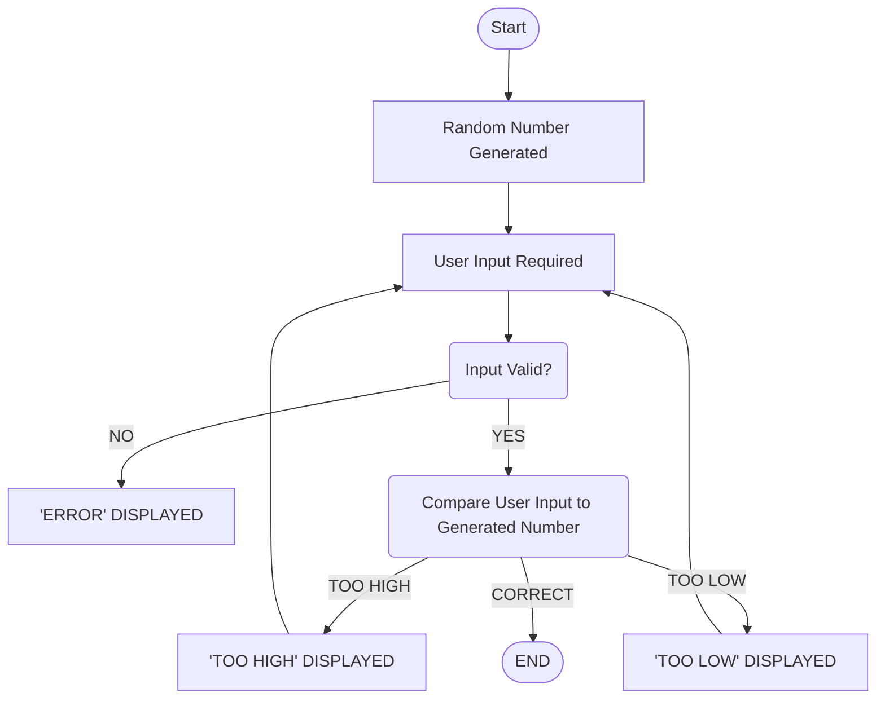

### GAME GUIDE: TEXTUAL DESCRIPTION 

1. **Start**

The game begins; entry point. 

2. **Number Randomly Generated**

The computer picks a random number from specified range.

3. **User Input Required**

The game askes the user to guess a number and prompts them to enter a response.

4. **Valid Input**

The game checks if the input is a valid numerical character within the specified range. 
* IF NO, error message is displayed and user asked to try again

5. **Compare User Input to Generated Number**

If valid, the game compares user input to the randomly generated number. 

6. **TOO HIGH**

If user input is too high, the message "TOO HIGH" is displayed. User is asked to input again 

7. **TOO LOW**

If user input is too low, the message "TOO LOW" is displayed. User is asked to input again.

8. **Correct** 

If the user input is the same number as the randomly generated number, a "Correct" message is displayed and the game ends. 

9. **End**

The game closes once the correct number is inputted. 
